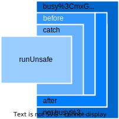

[](https://pub.dev/packages/use_in_case)
[](https://pub.dev/packages/use_in_case/score)

[](https://codecov.io/github/FelixCpp/use_in_case)

---


# Use-In-Case (UIC) Interactor

This library declares a base interactor interface aswell as a corresponding progress-interactor class. In order to use them there are quiet a lot of modifiers that can be used to do actions inside the invocation-flow of an interactor.


## Interactor Types

| Type name                     | Parameterized | Resulting |
| ----------------------------- | ------------- | --------- |
| ParameterizedResultInteractor | Yes           | Yes       |
| ParameterizedInteractor       | Yes           | No        |
| ResultInteractor              | No            | Yes       |
| Interactor                    | No            | No        |

## Usage

How to call an interactor in your code:

```dart
// Define an interactor that does something. He must extend/implement a type mentioned above.
final class StringToIntConverter implements ParameterizedResultInteractor<String, int> {
    @override
    Future<int> getOrThrow(String input) async {
        return int.parse(input);
    }
}

/// ...

// Create an instance of the interactor
final converter = StringToIntConverter();

/// ...

Future<int>  _ = converter.getOrThrow("123"); // Outputs: 123
Future<int?> _ = converter.getOrNull("not-a-number"); // Outputs: null
Future<int>  _ = converter.getOrElse("word", (_) => -1); // Outputs: -1
Future<void> _ = converter.run("123"); // Outputs: Nothing (void)
Future<void> _ = converter.run("word"); // Doesn't throw & returns void
Future<void> _ = converter.runUnsafe("123"); // Outputs: Nothing (void)
Future<void> _ = converter.runUnsafe("word"); // Throws exception
```

| Method name  | Description                                                                                  |
| ------------ | -------------------------------------------------------------------------------------------- |
| `getOrThrow` | Calls the interactor and throws an exception if the interactor fails.                        |
| `getOrNull`  | Calls the interactor and returns `null` if the interactor fails.                             |
| `getOrElse`  | Calls the interactor and returns a fallback value if the interactor fails.                   |
| `run`        | Calls the interactor and ignores the result. Also this method does not throw.                |
| `runUnsafe`  | Calls the interactor and throws an exception in case of a failure. The return type is void.  |

## Customization

The core feature of uic-interactor is the ability to customize the invocation-flow of an interactor.
This can be achieved by chaining multiple decorators to the interactor.

In the end your invocation-flow might look like this:

```dart
final result = stringToIntConverter
    .timeout(const Duration(seconds: 5))
    .before((input) => print("Trying to convert $input to string."))
    .after((output) => print("Successfully converted number to string. Result: $output"))
    .intercept((exception) => print("Failed to convert number to string. Exception caught: $exception"))
    .getOrNull("123") // Call the interactor with a parameter

// ...
```

Right now there are couple of decorators available:

| Decorator name      | Description                                                                                                   | Workflow                                  |
| ------------------- | ------------------------------------------------------------------------------------------------------------- | ----------------------------------------- |
| `after`             | Adds a hook that is called after the interactor is executed.                                                  |           |
| `before`            | Adds a hook that is called before the interactor is executed.                                                 |         |
| `busyStateChange`    | Adds a hook that is called when the interactor starts & ends.                                                 |   |
| `eventually`        | Adds a hook that is called when the interactor finishes.                                                      |    |
| `intercept`         | Adds a hook that is called when the interactor fails.                                                         |       |
| `typedIntercept`    | Adds a hook that is called when the interactor fails with a specific exception type.                          |       |
| `checkedIntercept`  | Adds a hook that is called when the interactor fails and a given predicate returns true.                      |       |
| `log`               | Times the operation and produces a message that can be displayed through logging library.                     |               |
| `map`               | Converts the output of the interactor.                                                                        |               |
| `recover`           | Calls a given callback when an exception has been thrown. The callback must return a fallback output.         |       |
| `typedRecover`      | Calls a given callback when a specific exception has been thrown. The callback must return a fallback output. |       |
| `checkedRecover`    | Calls a given callback when the given predicate returns true. The callback must return a fallback output.     |       |
| `timeout`           | Adds a timeout to the interactor.                                                                             |       |

## Order Matters

The graphic below shows in which order each decorator is going to append itself around the execution.

<table>
<td>

</td>
<td style="vertical-align: top;">

```dart
myInteractor
    .intercept((exception) => print("Exception caught: $exception"))
    .before((input) => print("Interactor called with parameter = $input"))
    .after((output) => println("Output produced: $output"))
    .busyStateChange((isBusy) => println("Busy State: $isBusy"))
```
</td>
</table>
</p>

## Declaring your own customizations

It is possible to write custom decorators that modify that invocation-flow of the interactor.

Examples can be found [here](lib/src/).

```dart
extension CustomModifier<Input, Output> on ParameterizedResultInteractor<Input, Output> {
  ParameterizedResultInteractor<Input, Output> customModifier() {
    return InlinedParameterizedResultInteractor((input) {
      print("I am here!")
      return await getOrThrow(input);
    });
  }
}
```

## Progress Interactors

In some cases the interactor might need to publish progress information.
Given a `FileDownloadInteractor` that downloads a file from the internet, it might look like this:

```dart
typedef SourceUrl = String;
typedef DestinationFilepath = String;
typedef Parameter = ({
  SourceUrl sourceUrl,
  DestinationFilepath destinationFilepath
});

typedef DownloadedBytes = int;
typedef DownloadProgress = int;

final class FileDownloadInteractor extends ParameterizedResultProgressInteractor<
    Parameter, DownloadedBytes, DownloadProgress> {
  @override
  Future<DownloadedBytes> getOrThrow(Parameter input) async {
    // TODO: Implement your file download here

    await emitProgress(0);

    // Download ...

    await emitProgress(100);
  }
}

// ...

void main() {
    final downloadService = FileDownloadInteractor();

    final result = await downloadService
      .receiveProgress((progress) async {
        print('Download-Progress: $progress%');
      })
      .getOrThrow((
        sourceUrl: 'https://example.com/image.jpg',
        destinationFilepath: 'image.jpg'
      ));

    print(result);
}
```

Just like the default interactor types written above, the ProgressInteractor provides a single method called `onProgress` which must be called before all other decorators. It gets called whenever the interactor wants to publish a progress-value to the caller. Due to API limitations it can only be registerd once in the method-pipe.

The naming-convention mirrors the previously declared interactors from above.

| Type name                             | Parameterized | Resulting |
| ------------------------------------- | ------------- | --------- |
| ParameterizedResultProgressInteractor | Yes           | Yes       |
| ParameterizedProgressInteractor       | Yes           | No        |
| ResultProgressInteractor              | No            | Yes       |
| ProgressInteractor                    | No            | No        |

---

An example might look like this:

```dart
myFileDownloadInteractor
    .receiveProgress((progress) => println("Downloaded ${progress}% of the file."))
    .timeout(const Duration(seconds: 30))
    .before((input) => println("Downloading file from ${input.sourceUrl} to ${input.destinationFilepath}."))
    .after((_) => println("Successfully downloaded file."))
    .intercept((exception) => println("Failed to download file. Exception caught: $it"))
    .eventually(() => println("Finished downloading file from."))
    .getOrNull(FileDownloadInteractorInput("https://example.com/file.txt", "/path/to/file.txt"))
```

# Examples of all available modifiers

The following section contains a bunch of examples covering all available modifiers provided by this library.

To avoid defining the interactor's used across all examples, they'll be defined in a code-block underneith the examples.

### before

... allows you to specify a callback that will be invoked before executing the interactor. "before" receives the given input as parameter.
```dart
final greetings = await greetName
  .before((name) => 'Called with $name')
  .getOrThrow('John');
```

### after
... allows you to specify a callback that will be invoked after executing the interactor. "after" receives the produced output as parameter. The specified callback will only be invoked when the interactor finished successfully.
```dart
await greetName
  .after((output) => print(output))
  .run('Barney');
```

### busy-state-change
... allows you to specify a callback that will be invoked before and after surrounding the execution of the interactor regardless of whether an exception has been thrown or not. Its parameter is of type boolean and represents whether the interactor is running or not. This is useful to emit loading states in your UI for example.
```dart
await greetName
  .busyStateChange((isBusy) => print('IsBusy: $isBusy'))
  .run('Josh');
```

### emit-busy-state-change
... allows you to specify a StreamController that will receive the current state of whether the interactor is running or not. This is useful in order to emit loading states in your UI for example.
```dart
await synchronizeData
  .emitBusyStateChange(isSyncingStreamController)
  .run();
```

### eventually
... allows you to specify a callback that will be invoked when execution of the interactor has finished. The speicified function will be called regardless of whether the interactor throws an exception or not.
```dart
await stringToInt
  .eventually(() => print('Conversion done'))
  .run('10283');
```

### intercept
... allows you to specify a `callback` that will be invoked when execution of the interactor threw an exception. The parameter of `callback` will be the produced exception of type `Exception`. Note that this method does not handle the thrown error but acts like a listener. In order to handle it, take a look at [recover](#recover), [typed-recover](#typed-recover) or [checked-recover](#checked-recover)
```dart
await stringToInt
  .intercept((exception) => print('Exception: $exception'))
  .run('not-a-number');
```

### typed-intercept
... allows you to specify a `callback` that will be invoked when an exception of a concrete type has been thrown by the interactor. Its callback receives the typed-exception as parameter. This interception also does not handle the exception but acts like a listener on it. In order to handle it, take a look at [recover](#recover), [typed-recover](#typed-recover) or [checked-recover](#checked-recover)
```dart
final result = await stringToInt
  .typedIntercept<FormatException>((exception) => print('FormatException caught'))
  .typedIntercept<OverflowException>((exception) => print('OverflowException caught'))
  .getOrNull('not-a-number');
```

### checked-intercept
... allows you to specify a `callback` and `predicate`. The given `callback` will be called when `predicate` returned true. This function represents the base functionality of the previously explained [intercept](#intercept) and [typed-intercept](#typed-intercept) extensions. Note that this function doesn't recover the exception but instead acts like a listener on it. In order to handle it, take a look at [recover](#recover), [typed-recover](#typed-recover) or [checked-recover](#checked-recover)
```dart
final result = await stringToInt
  .checkedIntercept(
    (exception) {
      print('This method caught an exception where "42" is contained within the  message.');
    },
    (exception) {
      if (exception.message.contains('42')) {
        return true;
      }

      return false;
    },
  ).getOrNull('not-a-number');
```

### log
... allows you to specify a bunch of functions to invoke when certain execution-stages are reached. `logBefore`, `logAfter` and `logError` must receive a string as parameter. `tag` is simply a name to identify the interactor execution.
```dart
await stringToInt
  .log(
    tag: 'String-To-Int',
    logBefore: printInfo,
    logAfter: printSuccess,
    logError: printError
  )
  .run('12');
```

### map
... allows you to specify a `callback` receiving the produced output, mapping it into a different one. The returned type doesn't have to equal the original output type. All following modifiers will work on the new output type defined by `map`.
```dart
final pi = await stringToInt
  .map((output) => output + 0.1415)
  .getOrThrow('3');
```

### cast
... allows you to specify a new output type of the previous interactor. The produced result is being explicitly casted to
the specified type.
```dart
final pi = await stringToInt
  .cast<MyNewType>()
  .getOrThrow(input);
```

### measure-time
... allows you to specify a `callback` receiving the duration it took to execute the interactor.
```dart
final result = await stringToInt
  .measureTime((duration) => print('Conversion took $duration'))
  .getOrThrow('19272');
```

### measure-time-on-success
... allows you to specify a `callback` receiving the duration it took to execute the interactor
only when it succeeded without throwing an exception.
```dart
final result = await stringToInt
  .measureTimeOnSuccess((duration) => print('Conversion took $duration'))
  .getOrThrow('19272');
```

### measure-timed-value
... Maps the output to a pair of type `Duration` and original `Output`-type. The duration will contain the value representing the time it took to execute the interactor. `Output` will be the produced value by the interactor.
```dart
final (duration, result) = await stringToInt
  .measureTimedValue()
  .getOrThrow();
```

### recover
... allows you to specify a `callback` receiving the thrown `Exception` and return an alternative value.
```dart
final result = await stringToInt
  .recover((exception) => -1)
  .getOrThrow('not-a-number');
```

### typed-recover
... allows you to specify a `callback` receiving the `Exception` of the requested exception type. Its content will only be invoked, when execution threw a failure object of the defined exception-type. An alternative value must be returned from the function.
```dart
final result = await stringToInt
  .typedRecover<FormatException>((exception) => -1)
  .typedRecover<OverflowException>((exception) => 0)
  .getOrThrow('not-a-number');
```

### checked-recover
... allows you to specify a `callback` that is only being invoked, when `predicate` returns true for a given exception. Its purpose is to return an alternative value and recover the output.
```dart
final result = await stringToInt
  .checkedRecover(
    (exception) => 42,
    (exception) {
      if (exception.message.contains('42')) {
        return true;
      }

      return false;
    }
  )
  .getOrThrow('not-a-number');
```

### ensure-min-execution-time
... ensures that execution at least take a specified amount of time. This time
is being used reguardless of how the interactor finishes (failure, success).
```dart
await synchronizeData
  .ensureMinExecutionTime(const Duration(seconds: 3))
  .run();
```

### ensure-min-execution-time-on-success
... ensures that execution takes at least the specified amount of time in case
the interactor does not fail. Otherwise the execution is being terminated immediately.
```dart
await synchronizeData
  .before((_) {
    if (...) {
      throw RuntimeException("This is an intended behavior")
    }
  })
  .ensureMinExecutionTimeOnSuccess(const Duration(seconds: 3)) //!< Only takes 3 seconds in success cases.
  .run();
```

### timeout
... ensures that execution does not take longer that a specified amount of time.
```dart
await synchronizeData
  .timeout(const Duration(seconds: 10))
  .run();
```

## Interactors used in the examples above.

### GreetName
```dart
final class GreetName implements ParameterizedResultInteractor<String, String> {
  @override
  FutureOr<String> getOrThrow(String input) async {
    return 'Hello, $input';
  }
}
```

### StringToInt
```dart
final class StringToInt implements ParameterizedResultInteractor<String, int> {
  @override
  FutureOr<int> getOrThrow(String input) async {
    return int.parse(input);
  }
}
```

### SynchronizeData
```dart
final class SynchronizeData implements Interactor {
  @override
  FutureOr<Unit> getOrThrow(Unit input) async {
    // Perform sync ...
    return Future.delayed(const Duration(seconds: 1), () => unit);
  }
}
```

---
>  For more examples, take a look into the [examples](./example) folder.