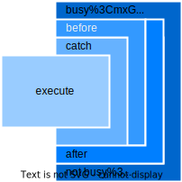

[](https://pub.dev/packages/use_in_case)
[](https://pub.dev/packages/use_in_case/score)

[](https://codecov.io/github/FelixCpp/use_in_case)

---


# Use-In-Case (UIC) Interactor

This library declares a base interactor interface aswell as a corresponding progress-interactor class. In order to use them there are quiet a lot of modifiers that can be used to do actions inside the invocation-flow of an interactor.


## Interactor Types

| Type name                     | Parameterized | Resulting |
| ----------------------------- | ------------- | --------- |
| ParameterizedResultInteractor | Yes           | Yes       |
| ParameterizedInteractor       | Yes           | No        |
| ResultInteractor              | No            | Yes       |
| Interactor                    | No            | No        |

## Usage

How to call an interactor in your code:

```dart
// Define an interactor that does something. He must extend/implement a type mentioned above.
final class StringToIntConverter implements ParameterizedResultInteractor<String, int> {
    @override
    Future<int> execute(String input) async {
        return int.parse(input);
    }
}

/// ...

// Create an instance of the interactor
final converter = StringToIntConverter();

/// ...

final _ = await converter.getOrThrow("123"); // Outputs: 123
final _ = await converter.getOrNull("not-a-number"); // Outputs: null
final _ = await converter.getOrElse("word", (_) async => -1); // Outputs: -1
final _ = await converter.run("123"); // Outputs: Nothing (void)
```

Notice the `getOrThrow` method. This is a helper method that is provided by the library to call the
interactor and throw an exception if the interactor fails.
Besides `getOrThrow` there are also some other methods to consider calling when needed.

| Method name  | Description                                                                |
| ------------ | -------------------------------------------------------------------------- |
| `getOrThrow` | Calls the interactor and throws an exception if the interactor fails.      |
| `getOrNull`  | Calls the interactor and returns `null` if the interactor fails.           |
| `getOrElse`  | Calls the interactor and returns a fallback value if the interactor fails. |
| `run`        | Calls the interactor and ignores the result.                               |

## Customization

The core feature of uic-interactor is the ability to customize the invocation-flow of an interactor.
This can be achieved by chaining multiple decorators to the interactor.

In the end your invocation-flow might look like this:

```dart
val result = stringToIntConverter
    .timeout(5.seconds)
    .before { println("Trying to convert $it to string.") }
    .after { println("Successfully converted number to string. Result: $it") }
    .catch { println("Failed to convert number to string. Exception caught: $it") }
    .getOrNull("123") // Call the interactor with a parameter

// ...
```

Right now there are couple of decorators available:

| Decorator name      | Description                                                                                                   | Workflow                                  |
| ------------------- | ------------------------------------------------------------------------------------------------------------- | ----------------------------------------- |
| `after`             | Adds a hook that is called after the interactor is executed.                                                  |          |
| `before`            | Adds a hook that is called before the interactor is executed.                                                 |        |
| `watchBusyState`    | Adds a hook that is called when the interactor starts & ends.                                                 |  |
| `debounceBusyState` | Adds a hook that is called with a specified debounce when the interactor starts & ends.                       |  |
| `intercept`         | Adds a hook that is called when the interactor fails.                                                         |      |
| `typedIntercept`    | Adds a hook that is called when the interactor fails with a specific exception type.                          |      |
| `eventually`           | Adds a hook that is called when the interactor finishes.                                                      |      |
| `log`               | Times the operation and produces a message that can be displayed through logging library.                     |              |
| `map`               | Converts the output of the interactor.                                                                        |              |
| `recover`           | Calls a given callback when an exception has been thrown. The callback must return a fallback output.         |      |
| `typedRecover`      | Calls a given callback when a specific exception has been thrown. The callback must return a fallback output. |      |
| `timeout`           | Adds a timeout to the interactor.                                                                             |      |

## Order Matters

The graphic below shows in which order each decorator is going to append itself around the execution.

<table>
<td>

</td>
<td style="vertical-align: top;">

```dart
myInteractor
    .intercept((it) => print("Exception caught: $it"))
    .before((it) => print("Interactor called with parameter = $it"))
    .after((it) => println("Output produced: $it"))
    .watchBusyState((it) => println("Busy State: $it"))
```
</td>
</table>
</p>

## Declaring your own customizations

It is possible to write custom decorators that modify that invocation-flow of the interactor.

Examples can be found [here](lib/src/).

```dart
fun <Input, Output> ParameterizedResultInteractor<Input, Output>.delayed(
    duration: Duration
) = ParameterizedResultInteractor<Input, Output> {
    delay(duration)
    this@delayed.execute(it)
}
```

## Progress Interactors

In some cases the interactor might need to publish progress information.
Given a `FileDownloadInteractor` that downloads a file from the internet, it might look like this:

```dart
typedef SourceUrl = String;
typedef DestinationFilepath = String;
typedef Parameter = ({
  SourceUrl sourceUrl,
  DestinationFilepath destinationFilepath
});

typedef DownloadedBytes = int;
typedef DownloadProgress = int;

final class FileDownloadInteractor extends ParameterizedResultProgressInteractor<
    Parameter, DownloadedBytes, DownloadProgress> {
  @override
  Future<DownloadedBytes> execute(Parameter input) async {
    // TODO: Implement your file download here

    await emitProgress(0);

    // Download ...

    await emitProgress(100);
  }
}

// ...

void main() {
    final downloadService = FileDownloadInteractor();

    final result = await downloadService
      .receiveProgress((progress) async {
        print('Download-Progress: $progress%');
      })
      .getOrThrow((
        sourceUrl: 'https://example.com/image.jpg',
        destinationFilepath: 'image.jpg'
      ));

    print(result);
}
```

Just like the default interactor types written above, the ProgressInteractor provides a single method called `onProgress` which must be called before all other decorators. It gets called whenever the interactor wants to publish a progress-value to the caller. Due to API limitations it can only be registerd once in the method-pipe.

The naming-convention mirrors the previously declared interactors from above.

| Type name                             | Parameterized | Resulting |
| ------------------------------------- | ------------- | --------- |
| ParameterizedResultProgressInteractor | Yes           | Yes       |
| ParameterizedProgressInteractor       | Yes           | No        |
| ResultProgressInteractor              | No            | Yes       |
| ProgressInteractor                    | No            | No        |

---

An example might look like this:

```dart
myFileDownloadInteractor
    .receiveProgress((progress) => println("Downloaded ${progress}% of the file."))
    .timeout(const Duration(seconds: 30))
    .before((input) => println("Downloading file from ${input.sourceUrl} to ${input.destinationFilepath}."))
    .after((_) => println("Successfully downloaded file."))
    .intercept((exception) => println("Failed to download file. Exception caught: $it"))
    .eventually(() => println("Finished downloading file from."))
    .getOrNull(FileDownloadInteractorInput("https://example.com/file.txt", "/path/to/file.txt"))
```

